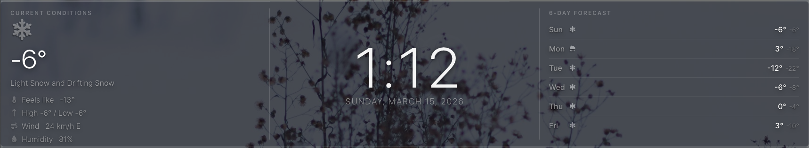

# MMM-ECWeather

A [MagicMirror²](https://magicmirror.builders/) module that displays weather data from [Environment Canada](https://weather.gc.ca/) using the free, keyless [GeoMet API](https://api.weather.gc.ca/).

**No API key required. No rate limits. No cost.**

## Features

- Current conditions: temperature, feels like (wind chill / humidex), condition text, weather icon
- Wind speed and direction in km/h
- Relative humidity
- Atmospheric pressure
- Multi-day forecast (up to 6 days) with high/low temperatures
- Environment Canada weather icons or Font Awesome icon mapping
- Bilingual support (English and French)
- Broadcasts weather data for other modules to consume

## Screenshot

3-column layout: Current Conditions | Clock | 6-Day Forecast



> **Note:** The clock in the center is MagicMirror's built-in `clock` module (no install needed). The 3-column layout uses two instances of MMM-ECWeather plus the clock — see [config.sample.js](config.sample.js) for the complete setup.

## Installation

1. Navigate to your MagicMirror modules folder:
   ```bash
   cd ~/MagicMirror/modules
   ```

2. Clone this repository:
   ```bash
   git clone https://github.com/MrRonco/MMM-ECWeather.git
   ```

3. No `npm install` required — this module has zero dependencies.

## Finding Your City ID

Environment Canada uses city identifiers like `on-40` (Greater Sudbury, Ontario).

To find your city:

1. Visit [weather.gc.ca](https://weather.gc.ca/) and search for your city
2. The URL will contain your city ID, e.g., `https://weather.gc.ca/en/location/index.html?coords=46.49,-80.99`
3. Or browse the API directly: `https://api.weather.gc.ca/collections/citypageweather-realtime/items?f=json&lang=en`

### Common City IDs

| City | Province | ID |
|------|----------|-----|
| Toronto | ON | `on-143` |
| Ottawa | ON | `on-118` |
| Greater Sudbury | ON | `on-40` |
| Montreal | QC | `qc-147` |
| Vancouver | BC | `bc-74` |
| Calgary | AB | `ab-52` |
| Edmonton | AB | `ab-50` |
| Winnipeg | MB | `mb-38` |
| Halifax | NS | `ns-19` |
| St. John's | NL | `nl-24` |

## Configuration

Add the module to your `config/config.js`. A complete sample configuration file is also available at [`config.sample.js`](config.sample.js).

```javascript
{
    module: "MMM-ECWeather",
    position: "top_left",      // or any MagicMirror region
    header: "Current Conditions",
    config: {
        cityId: "on-143"       // Your EC city identifier
    }
}
```

### Full Configuration Options

| Option | Default | Description |
|--------|---------|-------------|
| `cityId` | `"on-143"` | Environment Canada city identifier |
| `lang` | `"en"` | Language: `"en"` or `"fr"` |
| `updateInterval` | `600000` | Update interval in ms (default: 10 minutes) |
| `animationSpeed` | `1000` | DOM update animation speed in ms |
| `mode` | `"full"` | Display mode: `"full"`, `"current"`, or `"forecast"` |
| `showIcon` | `true` | Show weather icon |
| `showCondition` | `true` | Show condition text (e.g., "Partly Cloudy") |
| `showFeelsLike` | `true` | Show feels like / wind chill / humidex |
| `showWind` | `true` | Show wind speed and direction |
| `showHumidity` | `true` | Show relative humidity |
| `showPressure` | `false` | Show atmospheric pressure |
| `showForecastDays` | `5` | Number of forecast days (max 6) |
| `showForecastCondition` | `false` | Show condition text per forecast day |
| `tempUnit` | `"°"` | Temperature unit suffix |
| `iconStyle` | `"ec"` | `"ec"` for Environment Canada icons, `"fa"` for Font Awesome |
| `opacity` | `1` | Overall module opacity (`0`–`1`). Reduce to blend into the background. |
| `dimmedOpacity` | `0.45` | Opacity for secondary text — stats, labels, forecast day names (`0`–`1`). Set to `1` for full brightness. |

### 3-Column Layout (Current | Clock | Forecast)

A popular dashboard layout with current conditions on the left, the built-in clock in the center, and the multi-day forecast on the right:

```javascript
// Left — Current Conditions
{
    module: "MMM-ECWeather",
    position: "top_left",
    header: "Current Conditions",
    config: {
        cityId: "on-143",
        mode: "current",
        showIcon: true,
        showCondition: true,
        showFeelsLike: true,
        showWind: true,
        showHumidity: true,
        iconStyle: "fa"
    }
},

// Center — Clock (MagicMirror² built-in module)
{
    module: "clock",
    position: "top_center",
    config: {
        displayType: "digital",
        timeFormat: 12,
        showPeriod: false,
        showDate: true,
        dateFormat: "dddd, MMMM D, YYYY",
        displaySeconds: false,
        clockBold: false
    }
},

// Right — Multi-Day Forecast
{
    module: "MMM-ECWeather",
    position: "top_right",
    header: "6-Day Forecast",
    config: {
        cityId: "on-143",
        mode: "forecast",
        showForecastDays: 6,
        showIcon: true,
        iconStyle: "fa"
    }
},
```

## CSS Customization

The module uses semantic CSS classes that are easy to override in your `custom.css`:

```css
/* Temperature */
.ecw-temp {
    font-size: 56px;
    font-weight: 300;
}

/* Condition text */
.ecw-condition {
    font-size: 14px;
    opacity: 0.55;
}

/* Stat rows (feels like, wind, humidity) */
.ecw-stat-row {
    font-size: 13px;
    opacity: 0.45;
}

/* Forecast day rows */
.ecw-forecast-day {
    padding: 8px 0;
    border-bottom: 1px solid rgba(255, 255, 255, 0.07);
}
```

## API Reference

This module uses the Environment Canada GeoMet API:
- **Endpoint:** `https://api.weather.gc.ca/collections/citypageweather-realtime/items/{cityId}`
- **Documentation:** [api.weather.gc.ca](https://api.weather.gc.ca/)
- **Data source:** [Meteorological Service of Canada](https://www.canada.ca/en/services/environment/weather.html)
- **Cost:** Free
- **Rate limits:** None
- **API key:** None required

## Notifications

### Sent Notifications

| Notification | Payload | Description |
|-------------|---------|-------------|
| `CURRENT_WEATHER` | `{ temperature, condition, iconCode, windSpeed, humidity }` | Broadcast on each weather update. Can be consumed by other modules (e.g., MMM-DynamicWeather). |

### Received Notifications

None. The module fetches data independently via its node_helper.

## License

MIT License. See [LICENSE](LICENSE) for details.

## Credits

- Weather data provided by [Environment Canada](https://weather.gc.ca/) via the [GeoMet API](https://api.weather.gc.ca/)
- Built for the [MagicMirror²](https://magicmirror.builders/) platform
- Developed with the assistance of [Claude Code](https://claude.ai/claude-code) by Anthropic
